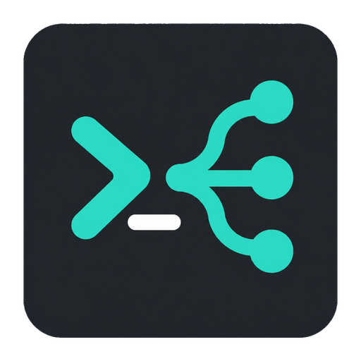

<p align="center">
  
</p>

# Nini Hub

Aplicación de escritorio local para organizar perfiles de CLI de IA, consultar
su disponibilidad, administrar suscripciones y lanzar agentes en diferentes
carpetas de trabajo desde un solo lugar.

Nini Hub está pensado para quienes trabajan con varias cuentas de **Codex**
y **Claude Code**. Reúne los perfiles creados con Multi CLI, sus cuotas, sus
renovaciones y los proyectos donde se utilizan, evitando saltar entre comandos,
carpetas y anotaciones separadas.

## Basado en Multi CLI

Nini Hub se construye sobre
[multi-cli de Spielewoy](https://github.com/Spielewoy/multi-cli), el proyecto
open source que proporciona la creación, separación y lanzamiento de perfiles
para herramientas de programación con IA.

Multi CLI administra los perfiles y su aislamiento a nivel de sistema;
Nini Hub añade la experiencia visual para descubrirlos, organizarlos,
consultar cuotas compatibles, registrar suscripciones y abrir cada agente en el
workspace adecuado. Ambos proyectos mantienen responsabilidades distintas y
Multi CLI continúa siendo el motor de perfiles utilizado por esta aplicación.

## Vista previa


| Crear un perfil | Administrar una suscripción |
| --- | --- |
|  |  |

## Funciones principales

- Descubre automáticamente perfiles de Codex y Claude Code administrados por
  Multi CLI.
- Crea perfiles compartidos, independientes o específicos para CLI.
- Renombra, elimina y abre perfiles sin abandonar la aplicación.
- Consulta la identidad, el plan y las cuotas reales disponibles para Codex.
- Actualiza todas las cuentas con concurrencia acotada y diferencia el estado
  actual del último resultado exitoso.
- Puede iniciar en segundo plano una ventana semanal de Codex que siga casi
  intacta, con una consulta breve y deduplicada por cuenta.
- Registra compras, precios, monedas, ciclos de facturación y próximas
  renovaciones.
- Organiza pagos compartidos, aportes pendientes y notas por suscripción.
- Conserva estadísticas de uso, calendario de actividad y tendencias de tokens.
- Mantiene una lista de workspaces y permite lanzar un agente con el perfil y la
  carpeta seleccionados.
- Incluye búsqueda, favoritos, filtros, temas claro y oscuro, colores de énfasis
  y modo compacto.

## Perfiles y workspaces

Cada perfil representa un entorno separado administrado por Multi CLI. Puede
usar la configuración principal, ser independiente o compartir ajustes según el
tipo elegido al crearlo.

Los workspaces se administran de forma global. Desde **Lanzar agente** se puede:

1. Buscar una carpeta registrada por nombre o ruta.
2. Añadir, renombrar u olvidar workspaces sin modificar el filesystem.
3. Elegir la cuenta que se utilizará.
4. Abrir Codex o Claude Code directamente en esa carpeta.

Esto permite alternar entre varios proyectos y suscripciones sin perder de vista
qué perfil tiene disponibilidad o cuál corresponde a cada trabajo.

## Proveedores

| Capacidad | Codex | Claude Code |
| --- | :---: | :---: |
| Descubrir perfiles Multi CLI | Sí | Sí |
| Crear perfiles compartidos o aislados | Sí | Sí |
| Lanzar en un workspace | Sí | Sí |
| Consultar identidad y cuotas | Sí | No expuesto por el CLI |
| Device auth desde la aplicación | Sí | No expuesto por el CLI |

Codex se integra mediante su app-server para obtener identidad, plan y ventanas
de cuota. Claude Code participa en el flujo de perfiles y lanzamiento; cuando
una capacidad no está disponible, la interfaz lo indica en lugar de estimarla.

## Suscripciones

La aplicación permite asociar información comercial a cada cuenta:

- Plan y estado de la suscripción.
- Fecha de compra y próxima renovación.
- Ciclo mensual, anual o personalizado.
- Precio esperado y moneda.
- Renovación automática.
- Tienda, canal de compra y método de pago descriptivo.
- Personas que comparten el costo y estado de sus aportes.
- Notas privadas para recordar acuerdos o detalles de la cuenta.

La actividad y los metadatos de organización se almacenan localmente en SQLite.
La autenticación continúa bajo el control de cada CLI y de sus perfiles.

## Estadísticas

Las consultas exitosas alimentan un historial local que permite visualizar:

- Tokens y consultas por día.
- Cuentas activas durante el periodo.
- Calendario mensual de actividad.
- Consumo y cuota disponible por cuenta.
- Tendencias de 7, 14, 30 y 90 días.
- Próximos reinicios de cuota.

Una consulta fallida nunca reemplaza silenciosamente el último dato válido. La
interfaz muestra por separado el resultado actual y la fecha del último éxito.

## Almacenamiento local

Nini Hub utiliza **Drift + SQLite** para guardar:

- El índice de perfiles descubiertos.
- Alias, favoritos y preferencias visuales.
- Workspaces registrados.
- Historial de consultas y ventanas de cuota.
- Suscripciones, renovaciones, pagos compartidos y notas.
- Logs redactados de las operaciones ejecutadas.

La raíz de perfiles se resuelve desde `MULTICLI_HOME` cuando está definida; en
caso contrario se utiliza `~/MultiCliProfiles`.

## Tecnologías

- Flutter Desktop y Dart.
- Riverpod para estado y dependencias.
- Drift y SQLite para persistencia local.
- JSON-RPC para la integración con Codex app-server.
- `fl_chart` y `table_calendar` para estadísticas.
- [Multi CLI](https://github.com/Spielewoy/multi-cli) para crear, separar,
  administrar y lanzar perfiles.

## Arquitectura

El proyecto separa interfaz, dominio, persistencia e integraciones externas:

```text
lib/
├── app/                 composición y controladores
├── core/                base de datos, procesos y utilidades
├── features/
│   ├── accounts/        cuentas y suscripciones
│   ├── profiles/        descubrimiento y administración
│   ├── usage/           cuotas e historial
│   ├── workspaces/      selección y lanzamiento
│   ├── activity/        logs de operaciones
│   └── settings/        preferencias de interfaz
├── providers/
│   └── codex/           cliente de Codex app-server
└── main.dart
```

La interfaz trabaja con modelos comunes. Las particularidades de cada CLI se
encapsulan en proveedores y gateways, de modo que una capacidad ausente no se
presente como disponible.

## Requisitos

- Flutter con soporte de escritorio habilitado.
- [Multi CLI](https://github.com/Spielewoy/multi-cli) disponible en el `PATH`.
- Codex y/o Claude Code instalados según los perfiles que se utilizarán.
- Linux para el entorno principal de desarrollo o Windows para generar el build
  nativo de esa plataforma.

## Desarrollo

Instalar dependencias y ejecutar en Linux:

```bash
flutter pub get
flutter run -d linux
```

Comprobar calidad y generar el build:

```bash
flutter analyze
flutter test
flutter build linux
```

En Windows:

```powershell
flutter pub get
flutter run -d windows
flutter build windows
```
